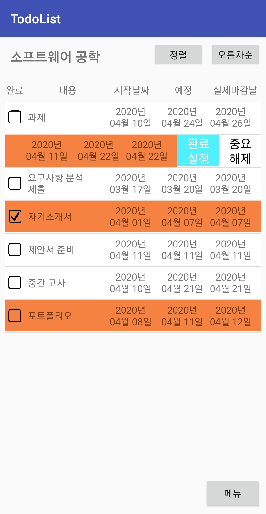

# To Do List

2017년 경기대학교 소프트웨어공학 팀 프로젝트

## 개요

MySQL 서버와 연동하는 안드로이드 기반 스케쥴링 애플리케이션입니다

To Do List 애플리케이션으로 앞으로 할 일을 관리할 수 있다.


## 팀원 및 역활

- PM : 이찬우
- 분석 / 설계 담당자 : 김광연
- 산출물 관리 담당 : 이찬우
- QA : 조정환
- 테스팅 담당자 : 고영훈, 발카짐


## UI




## 코딩표준

- Activity 명, 각 단어의 시작은 대문자

  - ``` java
    public class TodoActivity
    ```

- 변수의 이름은 소문자

  - ```java
    int parameter;
    ```

- 변수 선언부는 가급적이면 각 함수 최상단에 위치

  - ```java
    private String Body() {
        int alpha;
    ```

- 구분이 쉽게 들여쓰기

  - ```java
    if(success == true) {
    	int a;
    }
    ```

- 레이아웃과 메뉴 파일인 xml은 소문자로만 구성

  - ```java
    activity_main.xml
    menu.xml
    ```

- 레이아웃 파일은 가능하면 앞에 소문자로 된 activity를 붙이고 단어는_로 나눈다.

  - ```
    activity_main
    ```

- 메뉴의 경우, 각 파일명에 menu를 붙여서 메뉴라는 것을 알아볼 수 있도록 한다.

  - ```
    option_menu
    ```


## 요구사항

To-do 리스트

1. 수강하는 과목을 등록할 수 있다.
   - 과목 관련 정보: 과목 명, 담당 교수, 강의 요일/시간, 수강 년도/학기
     - 예) 소프트웨어공학, 도성룡 교수님, 금/9-12am, 2017/2
2. 과목 별로 To do 항목을 등록하여 To do List를 작성할 수 있다.
   - To do 항목 정보:
   - To do 항목 명, 마감 기한, 실제 마감일, 완료 여부, 중요 여부
     - 예) 요구사항명세서 작성, 2017/04/30, 2017/04/15, O, (중요 여부)
3. 중요 To do 항목에는 별도 표시가 가능하다.
4. To do 항목들의 추가/삭제/변경이 가능하다.
5. To do List는 정렬이 가능하다.
   - 정렬 방식:
   - 과목 명, 마감 기한, 실제 마감일, 완료 여부

6. 완료된 todo항목을 숨길 수 있다.

### 추가된 요구사항

7. 로그인 기능 추가
8. 외부 데이터 베이스와 연동

## 개발 기술

- Java
- PHP
- MySQLDB
- Volley Json


## 구조

1. 로그인 부분과 과목 부분의 diagram


1. 과목 등록의 diagram


1. To Do List 출력 부분의 diagram


1. To Do List 추가 부분의 diagram


## 실행 영상

[To Do List 실행 영상](https://youtu.be/dVfKHN6SX44)

## 추가한 것

학부 4학년 1학기 때 "컴퓨터 보안"을 듣고 보안이 비밀번호를 그대로 저장하는 건 위험하다는 걸 들었다.

그래서 암호를 byscript로 암호화 시켜서 보관했다.